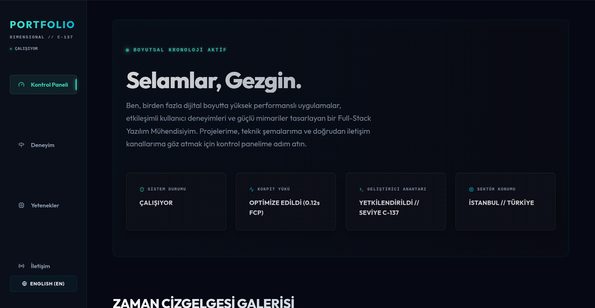
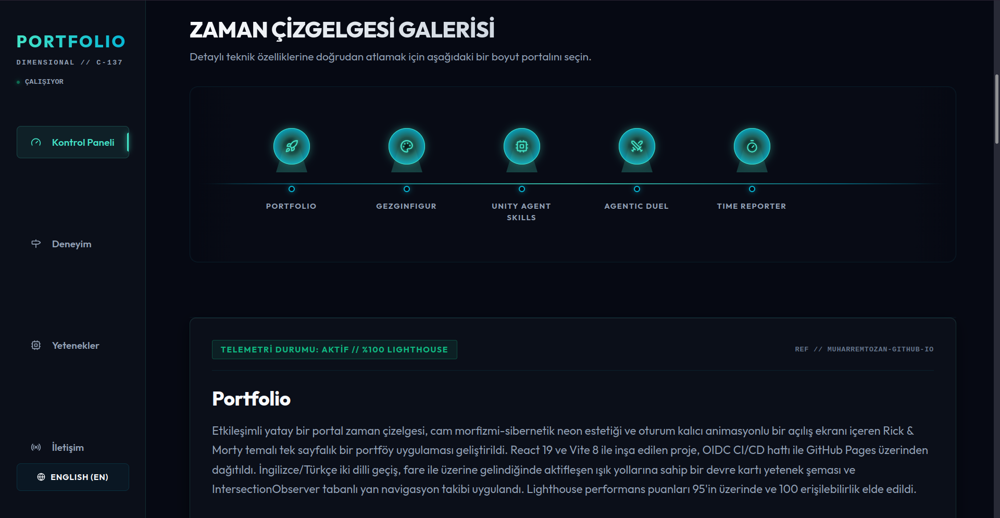

# The Dimensional Chronology

A Rick & Morty themed software engineering portfolio built with React 19 and Vite 8. Features an interactive portal timeline, bilingual English/Turkish support, and a cybernetic dashboard UI.

[](https://muharremtozan.github.io)

## Screenshots


*Dashboard with telemetry status cards and system diagnostics*


*Horizontal scrollable portal gallery for project navigation*

## Features

- **Portal Timeline** — horizontal scrollable project gallery with hologram-style portal nodes
- **Bilingual UI** — English/Turkish locale switching persisted in localStorage
- **Skills Schematics** — interactive circuit-board grid with hover-activated light paths
- **Session Splash Screen** — animated portal entry effect shown once per session
- **IntersectionObserver Nav** — sidebar tracking that highlights active sections on scroll
- **Telemetry Dashboard** — live system status cards with cybernetic aesthetic
- **Responsive** — sidebar collapses to mobile header on smaller viewports
- **Privacy-First** — zero analytics, fully static, no external data collection

## Tech Stack

- **React 19** + **Vite 8**
- **Pico CSS** (minimalist CSS framework)
- **Framer Motion** (animations)
- **Lucide React** (icons)
- **GitHub Pages** (hosting)
- **GitHub Actions OIDC** (CI/CD)

## Getting Started

```bash
npm install
npm run dev
```

Build for production:

```bash
npm run build
```

## Deployment

The site is deployed via GitHub Actions using OIDC authentication — no personal access tokens or SSH keys required. Every push to `main` triggers an automatic build and deploy to GitHub Pages.
