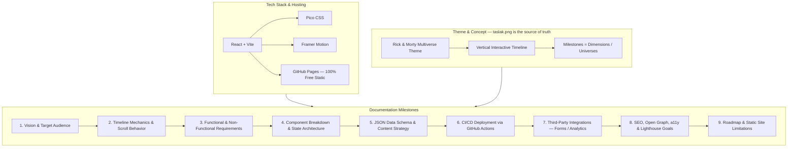
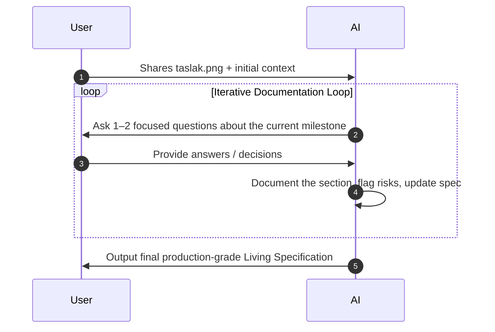

# Portfolio Documentation Prompt — Living Specification

## Project Context & Architecture Overview

---

## Your Role

Act as a **senior software architect, product manager, and technical writer**.

Do **not** generate the full documentation immediately. Follow the iterative workflow below — one milestone at a time, two questions maximum per turn.

---

## Visual Reference — taslak.png

`taslak.png` is attached and is the **primary authority** on layout, composition, and visual hierarchy throughout this entire process.

- Every UI/UX discussion must reference it directly.
- If a design decision conflicts with what is shown in `taslak.png`, flag it explicitly before proceeding.
- Use it to validate scroll behavior, milestone positioning, animation triggers, and spacing decisions.

---

## Operating Rules

1. **Challenge my choices.** If a Rick & Morty animation risks degrading Lighthouse scores, bundle size, or readability for a hiring manager, say so directly and propose a leaner alternative.
2. **Ask when unclear.** Whenever data schema details, scroll behaviors, or animation triggers are ambiguous — ask before assuming.
3. **Flag tradeoffs.** For every major architecture decision (e.g. client-side routing vs. hash anchors, CSS animations vs. Framer Motion), briefly note the tradeoff so it is documented in the spec.
4. **Keep the spec alive.** After each milestone, output a brief updated summary of decisions made so far.
5. **Performance is a first-class requirement.** Target Lighthouse Performance ≥ 90 on mobile. Treat bundle size and asset optimization as hard constraints, not afterthoughts.

---

## Let's Start

Please ask the **first set of questions** covering:

- Project Vision & Target Audience (who is the hiring manager persona?)
- Core Theme interpretation (how does the Rick & Morty multiverse map to a professional portfolio narrative?)
- Initial layout reading from `taslak.png` (what does the first viewport contain, and what is the entry animation?)
