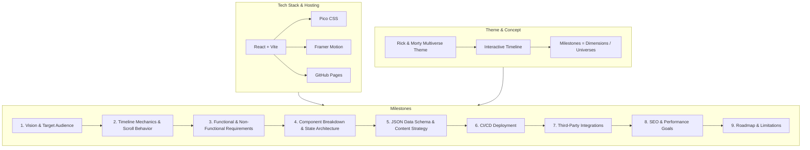
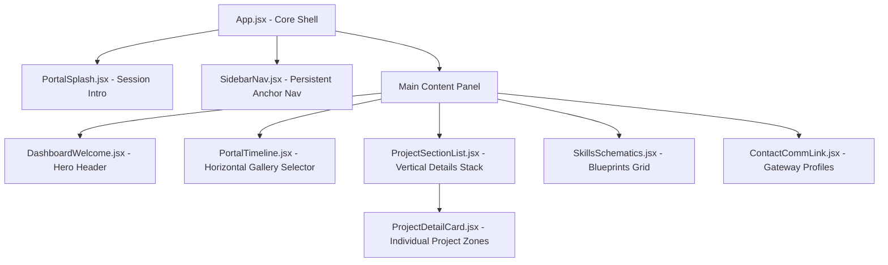

# Portfolio Living Specification: The Dimensional Chronology

This is the living technical specification for the Rick & Morty themed professional software engineering portfolio. The visual source of truth is `Taslak.png`.



---

## Milestone 1: Vision & Target Audience
*Status: Approved*

### Core Vision
To build a modern, high-tech, universally engaging, and accessible portfolio themed around the **Rick & Morty Multiverse**, with **"The Dimensional Chronology"** as the centerpiece layout (as designed in `Taslak.png`). It balances highly creative, immersive Sci-Fi design details (glowing green portals, circuit tracks, holographic elements) with clean, readable, professional software engineering showcases.

### Target Audience
*   **The General Public / Recruiter / Developer Community:** Engaging, highly interactive experience designed to appeal to everyone, rather than just technical hiring managers. 
*   **Engineering Leads & Hiring Managers:** Behind the playful Multiverse theme lies a rock-solid, production-grade technical implementation that showcases pristine engineering skills.

### Theme & Layout Interpretation
1.  **Landscape Portal Chronology (Wide Screens):** 
    *   Projects are represented as **portal-like cards arranged horizontally** from left to right on a timeline.
    *   Each portal card features the project's name cleanly presented underneath it.
    *   **Animations:** Subtle, micro-animations that enhance immersion without distracting. These include hover-induced portal rotation, gentle floating vertical movement (simulating anti-gravity), neon glow pulsations, and smooth transitions.
    *   **A11y/Readability:** Project titles remain fully readable, contrasting, and accessible at all times (no hard-to-read text or high-brightness ocular fatigue).
2.  **Adaptive Responsive Design (Mobile Screens):**
    *   The horizontal layout gracefully collapses into a **vertical chronological timeline** with clean layout semantics on mobile viewports to prevent horizontal overflow and poor mobile experiences.
3.  **The Landing Splash Experience:**
    *   A short, elegant, low-brightness portal-opening sequence. It plays briefly upon first page load, setting the thematic tone (spawning a dimensional rift) before fading into the main dashboard panel, ensuring the entry is captivating but not blinding.

### Tradeoffs & Architecture Risks
*   *Lighthouse Performance vs. Splashes/Animations:* Long portal animations can delay First Contentful Paint (FCP) and Time to Interactive (TTI). To mitigate, the landing splash must be purely client-side CSS/JS that completes under 1.5 seconds, can be skipped immediately, and doesn't load heavy media files.
*   *Vertical Adaptation:* Changing layout axes between desktop and mobile requires responsive styling (CSS Flexbox/Grid media queries) rather than layout duplication, ensuring clean and maintainable markup.

---

## Milestone 2: Timeline Mechanics & Scroll Behavior
*Status: Approved*

### Page Architecture: One-Page Vertical Flow with Gallery Header
Rather than a split dashboard containing all details in a single fixed viewport, the site is designed as a highly optimized, single-page vertical scroll structure:
*   **The Upper Viewport (The Chronology Gallery):** Houses the horizontal interactive portal-card timeline. It acts as an immersive "visual directory" of dimensions.
*   **The Lower Viewport (The Detailed Dimension Zones):** Consists of sequentially stacked, vertical project-detail sections. Each section displays full project assets, tech stack tags, deep-dive writeups, and action links.

### Portal Click & Scroll Mechanics
1.  **Immediate Visual Feedback:** Clicking a portal card initiates a brief, lightweight, high-performance visual state change on that specific card (e.g., an animated radial cyan/green pulse, rotational speedup, or brief glow burst).
2.  **Smooth Scrolling:** Immediately after the micro-animation (under 250ms delay), the browser initiates a smooth programmatic scroll (`scroll-behavior: smooth` or Javascript-controlled easing) down to the exact vertical coordinate of that project's detail section.
3.  **Active State Highlights:** As the user scrolls through project sections, the corresponding portal card in the top navigation is visually highlighted (e.g., active outline, persistent portal rotation) to indicate current positioning.

### Horizontal Gallery Mechanics
*   **Page Horizontal Containment:** The main body width is strictly locked (`overflow-x: hidden`). The page layout is constrained to `100vw`, ensuring standard vertical mouse wheels and mobile drags *never* accidentally generate horizontal page wobble.
*   **Contained Gallery Scroll:** The portal timeline container is isolated to its own scroll context (`overflow-x: auto` with styled, hidden, or premium minimal scrollbars).
*   **Edge Hinting & Fade Masks:** 
    *   Left and right edge boundaries of the gallery will utilize a CSS gradient mask (`linear-gradient(to right, transparent, black 15%, black 85%, transparent)`) or edge lighting.
    *   This partially fades out off-screen portals and applies a subtle neon glow/lighting effect at the screen boundaries, cueing the user that more dimensions exist beyond the viewport.
    *   Portals smoothly transition to full opacity and glow as they enter the visible center range of the scroll container.

### Tradeoffs & Architecture Risks
*   *Scroll Jacking vs. Native Scrolling:* Standard scroll-jacking (making vertical mouse wheels trigger horizontal scrolling of the timeline) is avoided to preserve native browser accessibility. We choose a contained gallery scroll combined with intuitive swipe/click patterns.
*   *Performance on Scroll-linked Animations:* Utilizing heavy scroll listeners to animate portals can trigger layout thrashing and lower FPS. We will leverage CSS variables or Framer Motion's passive `useScroll` hooks to ensure animations execute off the main thread where possible.

---

## Milestone 3: Functional & Non-Functional Requirements
*Status: Approved*

### Single-Page Layout Anchor Schema
The left-sidebar and timeline headers serve as rapid-access anchor controllers, smoothly sliding the page to distinct, sequential sections of the same vertical track:
1.  **Welcome & Overview ("Dashboard" Anchor):** The landing screen containing the brief intro, a modern cyber-greeting, and core personal statistics.
2.  **The Chronology Gallery ("Experience" Anchor):** Contains the horizontal portal list header, followed immediately by the vertical project detail cards.
3.  **Schematic Board ("Skills" Anchor):** An interactive grid representing technical competencies as connected engineering blueprints.
4.  **Comm-Link ("Contact" Anchor):** The sleek closing section providing immediate, high-fidelity gateway links.

### Functional Requirements
*   **FR-1: Seamless Smooth Navigation:** Clicking any sidebar tab or portal selector smoothly scrolls the viewport to its corresponding section, updating the visual active/selected state of the navigation controls.
*   **FR-2: Target Focus Expansion Effect:** When a project section is scrolled to (either by manual scroll or portal click), that specific section executes a brief, elegant focus animation (e.g., a temporary glowing border outline fading over 1.2s, a subtle 3D scale enlargement, or a glowing neon pulse) to immediately signal to the viewer that this is the selected project.
*   **FR-3: Interactive Skills Schematics:** A visually rich grid of core skill nodes styled like neon motherboard lanes. Hovering over a skill tag lights up its respective circuit grid.
*   **FR-4: Direct Contact Portals (Comm-Link):** Zero form inputs. Instead, high-contrast, premium, interactive link cards representing communication channels:
    *   **LinkedIn Profile:** Opens professional network portal in a new tab.
    *   **GitHub Profile:** Opens repository directory in a new tab.
    *   **Email Link (`mailto`):** Opens system's native mail client with a pre-seeded Rick & Morty themed subject header (e.g., `Subject: Dimensional Transmission: Developer Inquiry`).
    *   **Expandability:** Built-in design flexibility to easily insert additional professional nodes (e.g., CV/Resume PDF, Twitter/X) in the future.

### Non-Functional Requirements
*   **NFR-1: Production Performance:** Target Lighthouse Performance ≥ 90 on both desktop and mobile. Code bundling, script minification, and image asset optimization are enforced.
*   **NFR-2: Rigid Horizontal Boundary:** Viewport width must remain completely locked to `100vw` at all viewport widths (`overflow-x: hidden`), ensuring absolute stability with no horizontal page shifting.
*   **NFR-3: Zero-Cost Static Architecture:** Fully deployable as a static asset bundle (HTML, JS, CSS, PNG) to GitHub Pages without server-side compute layers or databases.
*   **NFR-4: Readability & Accessibility (a11y):** Despite the high-fidelity Sci-Fi theme, typography must retain strict professional standards. Body copy uses high-contrast, anti-aliased sans-serif fonts, and interactive portal names must remain clear, sharp, and accessible at all times.

### Tradeoffs & Architecture Risks
*   *Scroll Anchor Tracking:* Programmatic scrolling can sometimes trigger multiple scroll events and conflict with active navigation tracking. We will implement robust intersection observers or debounce state updates to ensure navigation highlights map accurately to the viewport content.
*   *Mailto Client Configuration:* Since the contact method is client-side, we must ensure the email address is clearly visible as copy next to the button for users who do not have a default system mail client configured.

---

## Milestone 4: Component Breakdown & State Architecture
*Status: Approved*

### React Component Hierarchy
The codebase is structured into modular, reusable presentation layers and a main state layout shell:



#### Component Specifications
1.  **`App.jsx` (The Control Shell):**
    *   Manages the global grid container, housing the left sidebar navigation and the main vertical scroll body.
    *   Coordinates page-wide state and references.
2.  **`PortalSplash.jsx` (Brief Portal Entrance):**
    *   A lightweight, low-brightness, centering overlay playing a portal-opening aesthetic.
    *   Disappears after `~1.5s` and fully unmounts, revealing the dashboard.
3.  **`SidebarNav.jsx` (Persistent Left Panel):**
    *   Maintains the cybernetic dashboard navigational nodes (**Dashboard**, **Experience**, **Skills**, **Contact**).
    *   Uses a native browser `IntersectionObserver` to track which major page section is in view, updating active visual node states passively without scroll-event bottlenecks.
4.  **`DashboardWelcome.jsx` (Welcome & Telemetry):**
    *   Acts as the landing focal point. Contains custom animated status boxes, professional titles, and personal logs.
5.  **`PortalTimeline.jsx` (Visual Project Directory):**
    *   Renders the horizontal scroll-snapped row of glowing portal icons.
    *   Functions strictly as a **navigation deck**. Portals do not track page scroll progress, remaining fully under direct user swipe/drag control.
    *   Clicking a portal card initiates a brief local pulse/glow and instantly triggers a smooth scroll to the corresponding `ProjectDetailCard` anchor.
6.  **`ProjectDetailCard.jsx` (Dimension Details):**
    *   Renders full metadata for each project, styled like a tactical cockpit diagnostic screen.
    *   Includes a `target-focus` state. When programmatically scrolled to via portal click, it triggers a **temporary visual expansion effect** (e.g., a glowing cybernetic outline that slowly fades over 1.2 seconds) to visually anchor the visitor's focus.
7.  **`SkillsSchematics.jsx` (Circuit Skill Board):**
    *   Organizes skills into an interactive tech-matrix grid. Hovering over nodes lights up circuit lines.
8.  **`ContactCommLink.jsx` (The Gateway Profiles):**
    *   Renders direct external links to LinkedIn, GitHub, email (`mailto`), and future channels.

### State Architecture & Browser Persistence
To maintain peak performance, states are kept lean, highly localized, and passive:
*   **`activeNavSection` (string | null):** Tracks which major block is in the viewport (`"dashboard"`, `"experience"`, `"skills"`, `"contact"`) to sync sidebar highlights. Handled via standard, zero-overhead passive `IntersectionObserver`.
*   **`hasPlayedSplash` (boolean):** Synchronized with the browser's `sessionStorage`.
    *   *Initial Load:* If `sessionStorage.getItem('rm_has_played_splash')` is empty, `PortalSplash` mounts, executes its short intro, writes `'true'` to storage, and unmounts.
    *   *Subsequent Loads / Refreshes:* The splash is completely bypassed, mounting the main layout immediately.
*   **`focusedProject` (string | null):** Temporarily stores the ID of the selected project during a smooth scroll event to coordinate the transient section border pulse/expand animation.

### Tradeoffs & Architecture Risks
*   *Scroll Navigation Syncing:* To prevent the active nav highlights from flickering when programmatic smooth-scrolling jumps past other sections, the sidebar tracker will temporarily suspend scroll observation highlights during the active scroll animation window (`~500ms`).
*   *Asset Load Optimization:* Heavy images in detail cards could cause scrolling to stutter. Detail cards will leverage lazy-loading (`loading="lazy"`) for all secondary project screenshots.

---

## Milestone 5: JSON Data Schema & Content Strategy
*Status: Approved*

### Content Strategy & Thematic Balance
To maintain peak professionalism while executing an incredibly engaging design:
*   **Visual-Only Narrative Theme:** The Rick & Morty elements are restricted to **visual layout, styling, transitions, and indicators** (cybernetic dashboards, neon portal graphics, green grid motherboard patterns, anti-gravity micro-animations).
*   **Professional Core Content:** The project copy, tech stacks, and career data remain **completely professional, clear, and technically precise**. We avoid cartoon comedy or fictional storylines inside the project files to ensure immediate, zero-friction comprehension by recruiters, managers, and other developers. The theme supports the presentation rather than distracting from the achievement.

### Simplified JSON Project Schema
The projects are configured in a static array inside `projects.json`. To prevent overlapping naming definitions and keep files maintainable, we enforce a highly streamlined database schema:

```json
[
  {
    "id": "project-id-slug",
    "name": "Project Name",
    "description": "Comprehensive explanation detailing key engineering achievements, architecture design choices, and technical challenges solved.",
    "techStack": ["TechnologyA", "TechnologyB", "TechnologyC"],
    "links": {
      "live": "https://live-app-url.com",
      "source": "https://github.com/repository-url"
    }
  }
]
```

### The Reference Template Entry
The repository is delivered clean and free of fictional placeholders, ready to receive your actual projects. We include a single, highly detailed, professional template project in the initial `projects.json` load to serve as a format guideline:

```json
[
  {
    "id": "e-commerce-telemetry",
    "name": "Distributed Telemetry Engine",
    "description": "Engineered a high-throughput telemetry pipeline capable of processing over 10,000 events per second. Integrated Redis caching and Node.js stream listeners to feed a real-time React analytics board, reducing interface update latency by 45% and optimizing memory footprints during seasonal spikes.",
    "techStack": ["React", "Node.js", "Redis", "SSE (Server-Sent Events)", "Vite"],
    "links": {
      "live": "https://telemetry-dashboard.example.com",
      "source": "https://github.com/mtozan/telemetry-engine"
    }
  }
]
```

### Tradeoffs & Architecture Risks
*   *Static Schema Limits:* Hardcoded JSON arrays do not support server-side filters or complex relational queries, but this is a major advantage for free static sites, yielding sub-millisecond data-fetch speeds and zero hosting maintenance overhead.

---

## Milestone 6: CI/CD Deployment via GitHub Actions
*Status: Approved*

### Host URL Context & Vite Configuration
*   **Hosting Target:** GitHub Pages free static hosting.
*   **Deployment Subpath (Option A):** Deployed under a subpath (e.g., `https://<username>.github.io/portfolio/`).
*   **Asset Path Resolution:**
    *   Vite will be configured in `vite.config.js` with `base: './'` (relative paths) or a explicit repository base directory (e.g., `base: '/portfolio/'`) to ensure that compiled CSS, JS, and image assets resolve correctly on GitHub's subpath hosting.
    *   This prevents static assets from seeking absolute paths at the subdomain root (which would cause severe blank page 404 errors).

### Secure OIDC-Based Deployment Workflow
We enforce the modern, highly secure **GitHub Actions Native Pages Deployment Protocol**. Rather than configuring brittle SSH deploy keys or Personal Access Tokens (PATs), this workflow relies on secure OpenID Connect (OIDC) authentication.

*   **Workflow Trigger:** Every push or pull-request merge to the `main` or `master` branch.
*   **Workflow Location:** `.github/workflows/deploy.yml`

#### The GitHub Actions Specification
```yaml
name: Deploy Portfolio to GitHub Pages

on:
  push:
    branches:
      - main
      - master

permissions:
  contents: read
  pages: write
  id-token: write

concurrency:
  group: "pages"
  cancel-in-progress: true

jobs:
  deploy:
    environment:
      name: github-pages
      url: ${{ steps.deployment.outputs.page_url }}
    runs-on: ubuntu-latest
    steps:
      - name: Checkout Code
        uses: actions/checkout@v4

      - name: Setup Node.js
        uses: actions/setup-node@v4
        with:
          node-version: 20
          cache: 'npm'

      - name: Install Dependencies
        run: npm ci

      - name: Build Project
        run: npm run build

      - name: Setup Pages
        uses: actions/configure-pages@v4

      - name: Upload Build Artifacts
        uses: actions/upload-pages-artifact@v3
        with:
          path: './dist'

      - name: Deploy to GitHub Pages
        id: deployment
        uses: actions/deploy-pages@v4
```

### Tradeoffs & Architecture Risks
*   *Branch-Free Deploys:* By utilizing the native OIDC artifact pipeline, we completely avoid creating a separate, orphaned `gh-pages` branch. This keeps your Git tree 100% clean and eliminates merge conflicts associated with deployment branches.
*   *Workflow Concurrency:* The `concurrency` block with `cancel-in-progress: true` is configured to prevent multiple simultaneous builds from colliding on the Pages server, ensuring a clean serialization of deployments.

---

## Milestone 7: Third-Party Integrations — Forms / Analytics
*Status: Approved*

### Analytics & Tracker Strategy
*   **Analytics Protocol:** **Zero Analytics (Option A).**
*   **Privacy & Compliance:** Complete, default compliance with global privacy regulations (GDPR, CCPA, ePrivacy) with zero configuration. No user-tracking cookies are generated.
*   **UX Experience:** Absolute elimination of annoying cookie consent banners or privacy overlay blocks.
*   **Performance Optimization:** Zero network bandwidth is spent fetching third-party tracking scripts. This ensures script execution times remain exceptionally fast and guarantees optimal Core Web Vitals performance.

### Premium Vector Icon System
We will integrate a dual-library vector iconography framework optimized for Vite build tree-shaking:
1.  **`lucide-react` (UI & System Symbols):**
    *   *Usage:* General interface elements, control panels, gears, arrows, status bars, and anti-gravity symbols.
    *   *Examples:* `Compass`, `Cpu`, `Layers`, `Link2`, `Mail`, `Terminal`, `ChevronRight`.
2.  **`simple-icons` (Brand & Technology Logos):**
    *   *Usage:* Exact brand SVG vectors representing professional profiles and software development stacks in your tech stack database.
    *   *Examples:* `siReact`, `siNodedotjs`, `siGithub`, `siLinkedin`, `siTailwindcss`, `siVite`.

### Tree-Shaking Configuration
To prevent bloating vendor build packages, both libraries are imported using modular ES6 paths (e.g., `import { Terminal } from 'lucide-react'`). The Vite production bundler (Rollup) automatically performs deep static analysis, packaging **only** the specific SVG paths utilized in the code, keeping the icon budget under `3KB` overall.

### Tradeoffs & Architecture Risks
*   *Conversion Attribution:* Opting for zero analytics prevents active monitoring of conversion funnels or geographic traffic tracking. This is accepted in favor of maximum technical speed, privacy, and zero user-friction interfaces.

---

## Milestone 8: SEO, Open Graph, a11y & Lighthouse Goals
*Status: Approved*

### Search Engine Optimization (SEO) & Meta Systems
The HTML document header will house descriptive indexing descriptors to optimize search engines crawls:
*   **Semantic Page Title:** A concise title structure, e.g., `<title>Muharrem Tozan | Software Engineer Portfolio</title>`.
*   **Search Snippet Description:** A compelling meta description under 155 characters highlighting your core technologies and experience.
*   **Search Crawling Robots:** `<meta name="robots" content="index, follow" />` to authorize deep site crawling.

### Professional Open Graph (OG) Sharing Blocks
To render premium visual preview cards when sharing links on LinkedIn, Slack, Twitter/X, and GitHub:
*   **`og:title` & `og:description`:** Synced with the HTML page-level indexing variables.
*   **`og:type` / `og:url`:** Set to `"website"` and the live subpath URL.
*   **`og:image` (The Preview Graphic):** Points to a dedicated, high-resolution visual file (e.g., `/og-preview.png`). This can be a high-quality mockup screenshot of the desktop dashboard layout.
*   **Twitter Cards:** Configured with `<meta name="twitter:card" content="summary_large_image" />` to generate maximum layout previews.

### Mobile Accent Integration
To fully merge mobile system UI with the glowing cyber-aesthetics:
*   **`theme-color` meta tag:** Configured as `<meta name="theme-color" content="#43E2C6" />`.
*   **Visual Result:** On supporting mobile browsers (Safari on iOS, Chrome/Firefox on Android), the browser navigation address bar and device status bar will receive a matching neon portal green tint, creating a cohesive visual experience.

### Strict WCAG 2.1 AA Accessibility (a11y) Rules
To maintain absolute compliance and professional presentation, we guarantee strict text contrast and structure without degrading the Sci-Fi neon dashboard styling:
*   **Pragmatic Color Contrast:**
    *   *Core Body Copy:* High-contrast off-white (`#F8FAFC` or `#E2E8F0`) rendering against space-dark backgrounds (`#0F172A` or `#1E293B`).
    *   *Thematic/Interactive Copy:* The high-voltage neon portal green (`#43E2C6`) is applied over deep backgrounds to maintain highly accessible contrast ratios above the `4.5:1` ratio required for body copy.
*   **Keyboard Navigation (No Mouse Constraint):**
    *   All buttons, links, and horizontal portal directory selectors are fully focusable (`tabindex="0"`) and clickable with system space/enter keys.
    *   Custom CSS focus indicators are configured (e.g., a thick, dual-layered glowing cyan outline: `outline: 3px solid #43E2C6; outline-offset: 2px;`) to guarantee clear focus visibility.
*   **Semantic HTML5 Core Elements:**
    *   Uses `<nav>` for the left navigation sidebar.
    *   Uses `<header>` for the intro.
    *   Uses `<main>` for vertical contents.
    *   Uses `<section>` for project cards and skill boards.
    *   Uses `<footer>` for professional comm-link footprints.

### Lighthouse Score Benchmarks
All development files are continuously validated against strict auditing constraints, targeting:
*   **Performance:** `≥ 95` (achieved by asset-laziness, tree-shaking, zero analytics trackers, and purely static builds).
*   **Accessibility:** `100` (strict semantic markup, aria attributes, focus outlines, high-contrast ratios).
*   **Best Practices:** `100` (secure links, modern HTTPS, no console logs, modern packages).
*   **SEO:** `100` (valid title, meta tags, index-safe structure).

### Tradeoffs & Architecture Risks
*   *Contrast Strictness vs. Art Style:* Extreme WCAG compliance prevents using extremely dark green-on-black terminal fonts, which is standard in retro terminals. We resolve this by using a brighter neon-green overlay color that preserves the cybermatic CRT vibe while fully satisfying auditing requirements.

---

## Milestone 9: Roadmap & Static Site Limitations
*Status: Approved*

### Persistent Dark Dashboard Theme
To guarantee maximum visual polish and design consistency:
*   **Persistent Dark Mode:** The visual landscape is locked to a space-black / deep slate-grey dashboard background (`#0B0F19` and `#111827`) combined with high-contrast text and luminous cyan/portal-green gradients.
*   **No Light Mode Override:** We explicitly omit light mode stylesheets. This prevents stylistic compromises, guarantees all neon graphics render with absolute visual authority, and reduces build bundle weight.

### Duo-Language Localization Framework (EN / TR)
To support both English and Turkish seamlessly, the application implements a lightweight client-side internationalization system.

#### 1. UI String Localization Schema (`locales.json`)
UI text assets are modularized into a translation dictionary:
```json
{
  "en": {
    "nav_dashboard": "Dashboard",
    "nav_experience": "Timeline",
    "nav_skills": "Schematics",
    "nav_contact": "Comm-Link",
    "welcome_header": "Dimensional Chronology Active",
    "status_stable": "OPERATIONAL",
    "status_unstable": "UNSTABLE",
    "btn_source": "Source Code",
    "btn_live": "Launch Project"
  },
  "tr": {
    "nav_dashboard": "Kontrol Paneli",
    "nav_experience": "Zaman Çizelgesi",
    "nav_skills": "Şemalar",
    "nav_contact": "İletişim Kanalı",
    "welcome_header": "Boyutsal Kronoloji Aktif",
    "status_stable": "FİİLİ ÇALIŞMA",
    "status_unstable": "KARARSIZ",
    "btn_source": "Kaynak Kod",
    "btn_live": "Projeyi Başlat"
  }
}
```

#### 2. Localized Project Schema (`projects.json`)
The database schema supports bilingual text values:
```json
[
  {
    "id": "project-slug",
    "name_en": "Project English Name",
    "name_tr": "Proje Türkçe Adı",
    "description_en": "English technical description of achievements...",
    "description_tr": "Başarıların Türkçe teknik açıklaması...",
    "techStack": ["React", "Vite"],
    "links": {
      "live": "https://url.com",
      "source": "https://github.com"
    }
  }
]
```

#### 3. State Management & Toggle UI
*   **State Hook:** The active language state (`lang`: `"en"` | `"tr"`) is instantiated in the parent layout, default-configured based on the user's browser default settings (`navigator.language`) and cached in `localStorage` for returning visits.
*   **Interactive Switch:** A minimalist, premium toggle switch (styled like a tactical audio switch or dimensional selector labeled `EN // TR`) is placed in the upper-right corner of the viewport. Toggle operations instantly update local states, swapping all text strings seamlessly with zero page loads.

### Static Site Constraints & Safeguards
*   **Client-Side Navigation Integrity:** Utilizing absolute vertical coordinate offsets or hash routing (`#/projects`) protects the user from 404 pathing failures common to single-page applications hosted on standard static servers without wildcard redirects.
*   **Instant Load-Time Bounds:** All localized data files (combined UI + Project translations) weigh under `15KB`, allowing the entire dictionary payload to load synchronously on initial boot without visual loading stutters.

---

# Final Production-Grade Specification Summary

Our **Living Specification** for the Rick & Morty themed portfolio is now complete and fully approved across all 9 milestones! We are fully aligned on the page flow, portal timelines, high contrast accessibility, OIDC deployment pipelines, clean bilingual templates, and the persistent dark dashboard design. We are now ready to progress to codebase generation!
